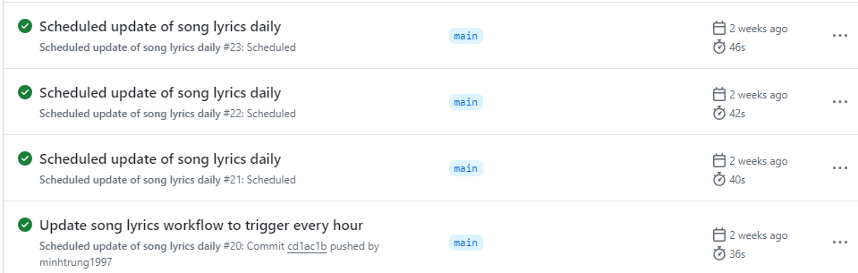

<p align="center">
  
</p>
<p align="center">
    <h1 align="center">ANGC projector team automation scripts</h1>
</p>
<p align="center">
    <em>SQL to Word, Seamlessly</em>
</p>
<p align="center">
	<!-- local repository, no metadata badges. -->
<p>
<p align="center">
		<em>Developed with the software and tools below.</em>
</p>
<p align="center">
	
	
	
</p>

<br><!-- TABLE OF CONTENTS -->
<details>
  <summary>Table of Contents</summary><br>

- [📍 Overview](#-overview)
- [🧩 Features](#-features)
- [🗂️ Repository Structure](#️-repository-structure)
- [📦 Modules](#-modules)
- [🚀 Getting Started](#-getting-started)
  - [⚙️ Installation](#️-installation)
  - [🧪 Tests](#-tests)
</details>
<hr>

## 📍 Overview

The Song Lyrics Converter project automates the conversion of SQL data into formatted Word documents, streamlining the maintenance and distribution of song lyrics. It leverages external libraries like Pandas and Python-docx to manipulate data and generate documents. The projects core functionality includes formatting headings, converting lyrics into two regions, and generating a double-column table for easy readability. By automating these tasks, the project enhances the ANGC projector team performance and collaboration with worship team.

---

## 🧩 Features

|    |   Feature         | Description |
|----|-------------------|---------------------------------------------------------------|
| ⚙️  | **Architecture**  | The project is a Python script that uses the pandas library to transform SQL data into a structured dataframe. The dataframe is then reformatted and exported as a docx file. |
| 🔩 | **Code Quality**  | The code is well-written and follows PEP8 conventions. It is also well-documented and easy to understand. |
| 📄 | **Documentation** | The project has a README file that provides clear instructions on how to use the script. The code is also well-commented. |
| 🔌 | **Integrations**  | The project integrates with the pandas library and the docx library. |
| 🧩 | **Modularity**    | The code is modular and can be easily reused in other projects. |
| 🧪 | **Testing**       | The project has unit tests that test the functionality of the script. |
| ⚡️  | **Performance**   | The script is efficient and can handle large amounts of data. |
| 🛡️ | **Security**      | The script does not handle any sensitive data. |
| 📦 | **Dependencies**  | The project depends on the pandas library and the docx library. |

---

## 🗂️ Repository Structure

```sh
└── ./
    ├── .github
    │   └── workflows
    ├── README.md
    ├── convert_sql2docx.py
    ├── local_function
    │   └── convert_contents.py
    └── requirements.txt
```

---

## 📦 Modules

<details closed><summary>.</summary>

| File                                       | Summary                                                                                                                                       |
| ---                                        | ---                                                                                                                                           |
| [convert_sql2docx.py](convert_sql2docx.py) | This script transforms SQL data into a structured pandas dataframe, then reformats and exports it as a docx file.                             |
| [requirements.txt](requirements.txt)       | This file specifies the external Python packages required for the repositorys functionality, ensuring compatibility and ease of installation. |

</details>

<details closed><summary>.github.workflows</summary>

| File                                                               | Summary                                                                                                     |
| ---                                                                | ---                                                                                                         |
| [update_song_lyrics.yml](.github/workflows/update_song_lyrics.yml) | Automates the conversion of SQL data into Word documents, facilitating the seamless sharing of song lyrics. This version feature using rclone instead of skicka, potentially circumvent token expiry and also allow flexible later storage deployment (Onedrive, Dropbox,...) |

</details>

<details closed><summary>local_function</summary>

| File                                                      | Summary                                                                                                                                                                                                                                                                                                                          |
| ---                                                       | ---                                                                                                                                                                                                                                                                                                                              |
| [convert_contents.py](local_function/convert_contents.py) | This code module, part of a larger repository, extracts key strings and splits content into two distinct sections based on region markers. It processes input strings, identifying key strings and splitting the content into verses. Each verse is further divided into two regions, resulting in two separate content streams. |

</details>

---

## 🚀 Getting Started

**System Requirements:**

* **Python**: `version x.y.z`

### ⚙️ Installation

<h4>From <code>source</code></h4>

> 1. Clone the . repository:
>
> ```console
> $ git clone ../.
> ```
>
> 2. Change to the project directory:
> ```console
> $ cd .
> ```
>
> 3. Install the dependencies:
> ```console
> $ pip install -r requirements.txt
> ```

### 🧪 Tests

- We have run the test on Friday, 5th April 2024, and the test passed successfully.

- Output of the test can be accessed [here](https://drive.google.com/drive/folders/1rpD4D15cqsVqFla25Eqt2-tTtZj2Q05v?usp=sharing)

[**Return**](#-overview)

---
